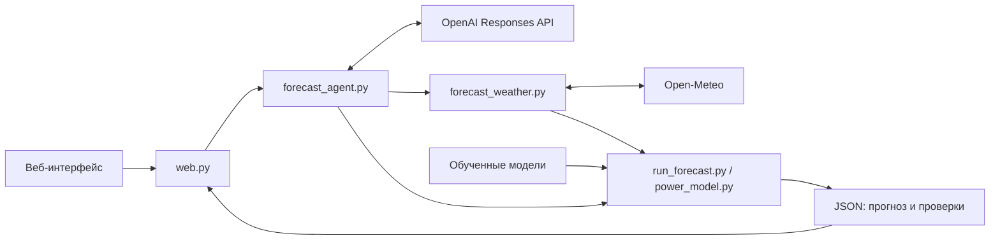

# ВЭС: прогноз, который можно проверить

Agentic AI-прототип для кейса [«Прогнозирование выработки ветроэлектростанции»](https://docs.google.com/document/d/1Fn5IJoj87Fx7IAknG26zkfX8c0eq7feCujd0m66PCgY/edit), трек «Энергетика», HackAlem AI.

Приложение помогает аналитику ВЭС получить почасовой прогноз двух турбин на **48 часов**, увидеть ожидаемые изменения мощности и проверить, из каких погодных данных и модели получен результат. Проверяемый период — **31 января — 28 февраля 2026 года**. Результат выражен в **нормализованной активной мощности от 0 до 1**, а не в МВт или МВт·ч.

**Быстрый старт:** Python 3.10+, команда `python3 web.py` из корня проекта, затем [http://127.0.0.1:8000](http://127.0.0.1:8000). Просмотр опубликованных результатов и записи агента работает без API-ключей, исходных CSV и подключения к интернету.

## Что реализовано

- **Численная модель каждой турбины.** Сглаженные эмпирические кривые «скорость ветра → мощность» обучены на исторических измерениях. Десятиминутные записи объединяются только в полные часы из шести наблюдений.
- **Получение архивного прогноза погоды.** Open-Meteo Single Runs API предоставляет выпуск ECMWF для координат двух турбин; приложение проверяет время выпуска, единицы измерения и непрерывность 48 часов.
- **Агент с вызовом инструментов.** OpenAI-модель выбирает следующие действия по результатам предыдущих: проверку входов, получение погоды, расчёт, исследование отдельных часов, сравнение и сохранение. Ошибка инструмента возвращается агенту для исправления или повторной попытки. Почасовые значения считает Python-модель, а не LLM.
- **Автономный проход тестового месяца.** Агент последовательно обрабатывает 29 дат на готовых моделях конкурсной станции без CSV. При предоставлении разрешённой истории доступен отдельный режим обучения. Повторный запуск продолжает работу по сохранённым и проверенным артефактам.
- **Периодическая проверка входов.** Отдельный процесс наблюдения проверяет погоду и модель для одной исторической даты и повторяет расчёт при изменении их содержимого.
- **Интерфейс для проверки.** График, три показателя, происхождение прогноза, почасовая таблица, журнал инструментов и прогресс месячного прохода. Запись прошлого запуска явно отделена от нового AI-расчёта.
- **Сохранённые результаты.** В `results/` находятся 29 ежедневных JSON по 48 часов и CSV на все 672 часа февраля. Соседние горизонты перекрываются; в сводном CSV для каждого часа выбран последний прогноз с уже наступившим временем решения.
- **Проверки и восстановление.** Атомарная запись файлов, контроль границ обучения и автоматические тесты повреждённых входов, ошибок и повторного запуска.

## Как работает решение

1. Пользователь выбирает дату расчёта. Сохранённый прогноз открывается сразу; новый расчёт запускается отдельной кнопкой.
2. Приложение задаёт исторический момент решения — **06:00 UTC** выбранного дня — и использует погодный выпуск предыдущего дня **18:00 UTC**. Например, для 1 февраля это выпуск 31 января 18:00 UTC.
3. Для каждой турбины загружаются 48 часов погоды. Модель мощности использует прогноз скорости ветра на 100 м. Обучение ограничено 30 января для решения 31 января и 31 января для февральских решений.
4. Численное ядро рассчитывает мощность каждой турбины и их среднее при допущении одинаковой установленной мощности, определяет низкую мощность и резкие часовые изменения.
5. Результат проходит проверки и сохраняется вместе с временными метками, параметрами модели и URL погодных запросов. В AI-режиме агент дополнительно формирует текстовую сводку и журнал действий.

В месячном режиме программа сама переходит к следующей исторической дате: ждать реальные сутки не требуется. В режиме наблюдения дата остаётся фиксированной, а проверка входов выполняется по интервалу. Это разные сценарии.

## Технологии

| Компонент | Реализация |
|---|---|
| Расчёт, обучение, API приложения | Python 3.10+, стандартная библиотека: `http.server`, `urllib`, `csv`, `json`, `math`, `threading` и другие модули |
| Интерфейс | HTML, CSS, JavaScript без фреймворка; SVG-график, Fetch API |
| Прогноз мощности | Две эмпирические кривые с гауссовым сглаживанием; калибровка прогнозного ветра для опубликованной февральской модели |
| LLM-агент | OpenAI Responses API, function calling; по умолчанию `gpt-5.4-mini`, модель задаётся через `OPENAI_MODEL` |
| Погодный источник | Open-Meteo Single Runs API, `ecmwf_ifs` |
| Хранение | JSON, CSV, файловый кеш, SHA-256 и атомарная замена файлов; без БД |
| Проверки | `unittest`; внешние API в автоматических тестах имитируются |

Для основного приложения не нужны `pip install`, Node.js, сборка frontend, Docker или GPU. Системная блокировка месячного прохода использует `fcntl`: этот режим рассчитан на Linux/macOS. Проверенная среда разработки — Python 3.13.

Отдельный [пилот NOAA GFS](experiments/noaa_gfs/README.md) использует NumPy и ecCodes в собственной среде. Он **не подключён к приложению** и не нужен для запуска; NVIDIA API в рабочем прогнозе не используется.

## Архитектура



| Файл или каталог | Ответственность |
|---|---|
| `web.py`, `static/index.html` | HTTP API и интерфейс; фоновые задачи агента, получение журнала по идентификатору |
| `forecast_agent.py`, `agent_settings.py` | Ограниченный цикл вызова инструментов, обработка ответов OpenAI и загрузка серверных настроек |
| `forecast_weather.py` | Архивные выпуски погоды, кеш, проверка координат, времени, единиц и часов |
| `power_model.py`, `calibrate_weather.py` | Обучение, применение и калибровка кривых мощности |
| `run_forecast.py` | Численный расчёт одной или нескольких дат без LLM; общие проверки и анализ |
| `run_campaign.py`, `station_profile.py` | Профиль двух турбин, обучение через агента, последовательный проход и возобновление |
| `watch_forecast.py` | Проверка входов по интервалу; повтор численного или AI-расчёта при изменениях |
| `storage.py`, `export_results.py` | Атомарная запись и сборка единого февральского CSV |
| `models/`, `results/`, `agent-examples/` | Опубликованные модели, прогнозы и записи реальных запусков |
| `validate_january.py`, `tests/`, `experiments/` | Оценка модели, автоматические проверки и отдельные эксперименты |

Агент получает только разрешённые инструменты со строгими аргументами. Он не имеет произвольного shell-доступа и не может заменить рассчитанную мощность текстом своего ответа. В месячном режиме добавлены инструменты проверки станции и обучения. Подробности — [docs/ARCHITECTURE.md](docs/ARCHITECTURE.md).

## Установка и запуск

### Локальный просмотр без ключей

```sh
git clone https://github.com/BAITC-Hacks/hack-c04b1cb2-m-m-s.git
cd hack-c04b1cb2-m-m-s
python3 --version
python3 web.py
```

Используйте Python 3.10 или новее. При ограниченном доступе к GitHub организатору нужен доступ к репозиторию команды; у самого локального приложения регистрации нет.

Откройте [http://127.0.0.1:8000](http://127.0.0.1:8000). Если порт занят, выполните `python3 web.py --port 8001`. Флаг `--port 0` позволяет системе выбрать свободный порт; адрес будет напечатан в терминале. Сервер слушает **127.0.0.1**, остановка — `Ctrl+C`.

### Какие входы нужны разным режимам

| Режим | Интернет | OpenAI API-ключ | Исходные CSV |
|---|---|---|---|
| Сохранённые графики, CSV и запись запуска | Нет | Нет | Нет |
| Новый численный прогноз | При отсутствии кеша; пересчёт из браузера всегда обращается к погодному API | Нет | Нет, модели включены в Git |
| Новый дневной AI-прогноз | Да | Да, на сервере | Нет |
| Автономный проход месяца на готовых моделях конкурсной станции | Да | Да, на сервере | Нет |
| Месячный проход с обучением, в том числе для другой станции | Да | Да, на сервере | Да |
| Автоматические тесты | Нет | Нет | Нет, используются временные синтетические данные |

### Новый запуск AI-агента

Создайте `.env` **в корне проекта** и укажите ключ команды:

```dotenv
OPENAI_API_KEY=your-team-api-key
OPENAI_MODEL=gpt-5.4-mini
```

`.env` исключён из Git. Приложение читает его само; выполнять `source .env` не нужно. Ключ остаётся на сервере и не передаётся браузеру. После изменения настроек перезапустите сервер. Откройте приложение и нажмите **«Запустить AI-агента»**.

Без ключа кнопка нового запуска отключена, но сохранённые результаты и запись остаются доступны. Запись не заменяет проверку нового LLM-запуска. На настроенном сервере ключ предоставляет команда: посетителю не нужен собственный аккаунт OpenAI.

### Автономный проход месяца без CSV

Для стандартной конкурсной станции достаточно серверного `OPENAI_API_KEY`: если `WIND_TRAINING_DIR` не задан или пуст, используются готовые модели из `models/`. Это новые дневные AI-расчёты с получением погоды и проверками, а не воспроизведение записи. Повторного обучения в этом режиме нет.

Раскройте **«Весь тестовый месяц»** и нажмите **«Пройти февраль автономно»**. Интерфейс сообщает, что используются готовые модели и исходные CSV не нужны. Если в `.env` остался пример `WIND_TRAINING_DIR=/path/to/csv`, удалите эту строку: явно заданный несуществующий каталог считается ошибкой конфигурации.

Через CLI, с тем же серверным ключом:

```sh
# Короткая проверка первых двух дней на готовых моделях
python3 run_campaign.py --days 2

# Все 29 дней; завершённые дни будут проверены и пропущены
python3 run_campaign.py
```

Режим готовых моделей разрешён только при точном совпадении координат обеих конкурсных турбин. Название и идентификатор профиля могут отличаться. Режим сохраняет опубликованные параметры модели, включая февральскую поправку ветра ×1,10.

### Обучение на разрешённой истории

Используйте исходные данные только в разрешённой организаторами среде. В каталоге истории должны находиться `turbine-1.csv` и `turbine-2.csv` с исходной схемой колонок. Они не входят в Git. Без них расчёт на готовых моделях доступен, а переобучение — нет.

Профиль [stations/example.json](stations/example.json) уже включён в репозиторий: он содержит `id`, `name` и координаты двух турбин. Координаты задаёт оператор, агент их не угадывает. Для другой станции нужны её собственный профиль и совместимая история.

Для режима обучения через веб-кнопку дополните `.env`:

```dotenv
WIND_STATION_FILE=stations/example.json
WIND_TRAINING_DIR=/absolute/path/to/authorized-csv
```

`WIND_STATION_FILE` можно не задавать: указанный профиль используется по умолчанию. Путь к CSV указывает на каталог **сервера**, а не компьютера посетителя. Раскройте **«Весь тестовый месяц»** и нажмите **«Пройти февраль автономно»**.

Для проверки через CLI, с тем же серверным ключом:

```sh
# Короткая проверка первых двух дней
python3 run_campaign.py --station stations/example.json --input-dir /absolute/path/to/authorized-csv --days 2

# Все 29 дней; ранее завершённые дни будут проверены и пропущены
python3 run_campaign.py --station stations/example.json --input-dir /absolute/path/to/authorized-csv
```

Результаты обоих режимов сохраняются отдельно в `predictions/campaigns/`; имя папки учитывает профиль, режим и хеши входов. На каждом дне допускается до двух попыток. После неисправленной ошибки проход останавливается; повтор команды продолжает незавершённые или повреждённые результаты. После перезапуска веб-сервера для продолжения нужно повторно нажать кнопку. В режиме обучения новая модель станции не получает автоматически конкурсную калибровку ветра ×1,10.

### Численный расчёт и периодическое наблюдение

Команды не требуют OpenAI-ключа; при пустом кеше нужна сеть для получения погоды:

```sh
# Один прогноз на 48 часов
python3 run_forecast.py 2026-02-01 --model models/power-curve-2026-01-31.json

# Весь тестовый период, результаты в predictions/
python3 run_forecast.py 2026-01-31 --days 29 --model-dir models

# Наблюдение за входами одной даты каждые 300 секунд
python3 watch_forecast.py 2026-02-01 --model-dir models --interval 300
```

Наблюдатель сравнивает хеши погоды и модели. При неизменных входах, в том числе после повторного старта, результат не переписывается. Сбой оставляет предыдущий успешный прогноз. Добавление `--agent` включает LLM-цикл при первом запуске или изменении входов и требует серверного ключа. Автоматического дообучения по новым CSV в наблюдателе нет.

## Как жюри проверить решение

### Основной сценарий: без ключа и исходных данных

1. Запустите `python3 web.py`. Сразу откроется сохранённый прогноз на 1 февраля: 48 часов с 01.02 06:00 до 03.02 05:00 UTC. Среднее по ветропарку — **0,248**, максимум — **0,873**, наибольший часовой скачок — **0,297**.
2. Выберите **28 февраля**: сохранённый прогноз загрузится автоматически. Кнопка **«Открыть прогноз»** позволяет вернуться к опубликованному снимку выбранной даты после AI-расчёта или записи.
3. Раскройте **«Происхождение и проверки прогноза»** и **«Почасовые значения · 48 часов»**. Проверьте время решения, погодный выпуск, границу обучения и наличие 48 строк.
4. Нажмите **«Скачать февраль CSV»**: файл содержит 672 часа февраля без пропусков.
5. Нажмите **«Запись запуска 1 февраля»**. График получит метку **«Запись запуска»**; ниже будут сводка и раскрываемые вызовы инструментов реального сохранённого запуска. При этом OpenAI не вызывается.

### Новый расчёт

- При наличии сети раскройте сведения о прогнозе и нажмите **«Пересчитать из архива»**. Появится метка **«Пересчитан из архива»**; новый файл сохранится в `predictions/`, исходные `results/` не заменяются.
- С настроенным серверным ключом нажмите **«Запустить AI-агента»**. Дождитесь завершения: журнал должен содержать реальные вызовы инструментов, а график — метку **«AI-расчёт»**. Порядок и число шагов могут отличаться от записи.
- Для месячного режима на готовых моделях достаточно серверного ключа; выполните короткую проверку `python3 run_campaign.py --days 2`. Для проверки именно обучения дополнительно нужны разрешённые CSV. Повтор неизменного завершённого прохода пропускает сохранённые дни без новых LLM-вызовов.

### Автоматические проверки

В отдельном терминале из корня проекта:

```sh
python3 -m unittest discover -s tests -v

# Пересобрать CSV отдельно от опубликованного файла
python3 export_results.py --input-dir results --output predictions/february-check.csv

# Linux/macOS: отсутствие вывода и код 0 означают побайтное совпадение
cmp results/february-hourly.csv predictions/february-check.csv
```

Ожидается завершение **56 тестов** с **OK**, сообщение о сохранении **672 часов** и совпадение CSV. Тесты проверяют хронологию обучения и калибровки, повреждённые входы, ошибки сети и записи, повторный старт, проход на готовых моделях без CSV, восстановление кампании и общий лимит веб-запусков. Они не расходуют OpenAI-кредиты.

Проверка наблюдателя с реальным погодным API, ограниченная двумя циклами:

```sh
python3 watch_forecast.py 2026-02-01 --model-dir models --interval 5 --max-cycles 2
```

При неизменном архиве второй цикл сообщает `inputs unchanged`. Изменение данных и восстановление после сбоя проверяются также автоматическими тестами с синтетическими входами; они не подменяют опубликованные прогнозы.

## Данные и интеграции

**История турбин.** Два CSV организатора доступны через [карточку трека](https://edu.astanahub.com/hackathons/df4743f5-c492-415c-b45a-1f13adb78e06?tab=tracks). История заканчивается 31.01.2026; фактической февральской мощности в предоставленных файлах нет. Модель использует время, скорость ветра и нормализованную мощность; температура проверяется и агрегируется, но не служит признаком прогноза мощности.

Исходные CSV не включены в Git: инструкция организаторов ограничивает копирование и распространение данных. Разрешение на перенос на внешний сервер нельзя считать автоматически полученным. В репозитории находятся агрегированные модели и контрольные суммы входов. Для повторного обучения необходим доступ к оригинальным CSV в разрешённой среде.

**Погода.** Рабочий источник — [Open-Meteo Single Runs API](https://open-meteo.com/en/docs/single-runs-api), модель `ecmwf_ifs`, переменные `wind_speed_10m`, `wind_speed_100m`, `temperature_2m`, UTC и м/с. Координаты взяты из ТЗ и сохранены в `stations/example.json`. Кеш лежит в `weather-cache/`; URL, время выпуска и время решения сохраняются в прогнозе. Условия источника и атрибуция CC BY 4.0 приведены в [docs/SOURCES.md](docs/SOURCES.md).

**OpenAI.** Сервер использует Responses API для выбора инструментов и текстовой сводки. Исходные строки CSV в LLM не передаются; передаются результаты инструментов, включая агрегаты и рассчитанные значения. Запись [дневного запуска](agent-examples/2026-02-01-report.json) и [сводка 29-дневного прохода](agent-examples/2026-02-campaign-summary.json) фиксируют реальные вызовы, модель, время и расход токенов. Они получены при проверке проекта 23.09.2026, а не во время исторического февраля.

**Происхождение разработки.** `.codex/` содержит инструкции для разработки и ревью, а не исполняемые инструменты прогнозного агента. Подготовленные до старта роли и конфигурация раскрыты в [docs/PREPARED.md](docs/PREPARED.md); специализированные роли ревью добавлены во время работы. Для запуска приложения Codex не требуется.

## Проверенные результаты и ограничения

На отложенном периоде **15–31 января**, после подбора множителя ветра на 1–14 января, получены следующие ошибки нормализованной мощности:

| Турбина | Сопоставленных часов | MAE без поправки | MAE с поправкой ×1,10 |
|---|---:|---:|---:|
| 1 | 397 | 0,164619 | 0,150873 |
| 2 | 397 | 0,169391 | 0,155187 |

Это улучшение примерно на 8,4% относительно той же кривой без поправки, а не заявленная точность на феврале. Исходная кривая этой проверки обучена по 31.12.2025; сопоставление использует **гипотезу** часового пояса CSV UTC+5. Методика, отдельная оценка горизонтов 0–23 и 24–47 часов и команды воспроизведения — [docs/VALIDATION.md](docs/VALIDATION.md), [experiments/lead_time_check/](experiments/lead_time_check/README.md).

Ограничения текущей версии:

- **Исторический тест двух турбин.** Нет оперативного прогноза на сегодняшнюю дату, поддержки произвольного числа турбин, геокодирования или загрузки произвольных таблиц через браузер.
- **Выход 0–1.** Номинальные мощности неизвестны; МВт, МВт·ч и экономия денег не рассчитываются. Среднее предполагает равную мощность турбин.
- **Точность февраля неизвестна.** Февральского факта нет; успешная проверка 48 часов, совпадение расчётов и работа агента не доказывают точность прогноза.
- **Неопределённость измерений.** Часовой пояс CSV и высота датчика ветра не подтверждены. Модель обучается на ветре датчика и применяется к прогнозу на 100 м.
- **Происхождение архива.** Open-Meteo описывает архив ECMWF как `IFS Cycle 49R1 hindcasts`. Идентичность исходным оперативным выпускам и точное время исторической публикации независимо не подтверждены. Зазор в 12 часов не устраняет это ограничение; подробности — [docs/SOURCES.md](docs/SOURCES.md).
- **Ограниченная автономность.** Агент выбирает действия в заданном наборе инструментов. Он не ищет новые источники сам, не выбирает архитектуру ML и не переносит автоматически калибровку между станциями.
- **Зависимость живого AI от сервиса.** Нужны доступный OpenAI API, серверный ключ и квота. Дневной запуск ограничен 8 ответами модели и 12 вызовами инструментов; в кампании — 12 ответами и 16 вызовами на попытку дня.
- **Демонстрационный веб-сервер.** Один одновременно работающий агент и до 6 стартов в час на процесс. Нет пользовательской авторизации; при публичном размещении запуск агента доступен посетителям с общей квотой команды. Встроенного HTTPS и настройки промышленного развёртывания в репозитории нет.
- **Сохранённые и новые результаты разделены.** Обычный просмотр и скачиваемый CSV используют `results/`. Новые расчёты и кампании пишутся в `predictions/`; они не заменяют опубликованный набор. Исторические файлы `results/` получены численным циклом и не выдаются за работу LLM в феврале.

## Развёрнутая версия

Адрес демонстрации команды: [hackalem.celestial.kz](https://hackalem.celestial.kz/).

**Статус проверки 23.09.2026:** публичный адрес открывается по HTTPS, но возвращает `502 Bad Gateway`. Новый AI-запуск через этот домен пока не подтверждён. До восстановления доступа воспроизводимый способ проверки — локальный запуск и сценарии выше; наличие ссылки не означает проверенную доступность демо.
