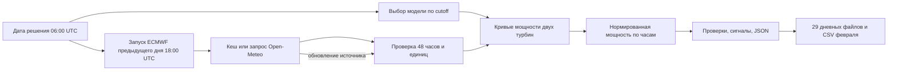

# Устройство прогнозного агента

Решение состоит из обучаемой модели и автономного цикла, который ежедневно воспроизводит историческое решение. Внешняя LLM и личный API-ключ не нужны. «Агентность» здесь означает, что один запуск сам выбирает допустимый погодный выпуск и модель для даты, получает и проверяет данные, строит прогноз, анализирует результат и может повторить цикл при обновлении источника. Метод не выдаётся за свободно рассуждающего чат-агента.

`forecast_weather.py` фиксирует URL, координаты, модель ECMWF, время запуска и время решения. Между ними 12 часов при документированной типичной задержке публикации 4–6 часов. В кеше сохраняется только 48-часовое окно с нужными переменными. Если хотя бы одного часа или значения нет, агент завершает цикл с ошибкой вместо подстановки фактической погоды.

`power_model.py` строит две отдельные эмпирические сглаженные кривые по полным часам исторических измерений. Это обученная на данных организатора модель, не готовая сторонняя модель. В феврале `calibrate_weather.py` умножает прогнозную скорость ветра на коэффициент, выбранный по раннему январю и проверенный на позднем январе. Данные за февраль для обучения не используются.

`run_forecast.py` выбирает артефакт с cutoff не позже дня перед решением. Для 31 января это 30 января; для каждого дня февраля — 31 января. Затем он прогнозирует обе турбины, проверяет диапазон 0–1 и согласование временных меток, считает среднее при допущении равной установленной мощности, фиксирует часы низкой мощности и резкие изменения. Каждый JSON содержит погодные URL, время выпуска, решение, cutoff и коэффициенты калибровки. `--refresh-weather` заново получает архивный выпуск и повторяет все этапы.

`export_results.py` проверяет сохранённые ежедневные файлы и собирает один ряд из 672 часов февраля. При перекрытии двух горизонтов он выбирает прогноз с более поздним временем решения, если оно уже наступило к целевому часу. Это не позволяет использовать будущие измерения или выпуск погоды задним числом. `web.py` показывает опубликованный JSON без сети, а кнопка повторного расчёта проверяет цикл с новой загрузкой погодного архива; новый файл сохраняется отдельно от опубликованного результата.

Ошибки входа, неполный погодный ответ и неверные единицы останавливают расчёт. Сервис не домысливает недостающие часы. Отсутствие подтверждённого часового пояса CSV, высоты датчика и установленной мощности турбин описано в [VALIDATION.md](VALIDATION.md); эти факты ограничивают практическую точность.
