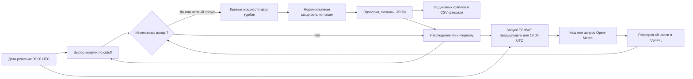

# Устройство прогнозного агента

Решение состоит из обучаемой численной модели, воспроизводимого цикла исторических решений и инструментального LLM-агента. Базовый расчёт и просмотр сохранённых результатов работают без ключей. В онлайн-режиме `forecast_agent.py` передаёт OpenAI Responses API цель и разрешённые инструменты; LLM выбирает вызовы и получает их результаты до завершения задачи. Числа прогноза всегда вычисляет `combine`, а не LLM. Отдельный режим наблюдения обнаруживает изменение погоды или модели; с `--agent` он запускает инструментальный цикл только при изменении входов.

## Инструментальный цикл

Агент может проверить модель и кеш, загрузить архивный выпуск для каждой турбины, запустить численный расчёт, исследовать выбранный интервал часов, сравнить результат с опубликованным снимком и сохранить его. Каждая функция имеет строгую схему аргументов. Результат или безопасная ошибка возвращается модели; следующая операция выбирается с учётом этого ответа. При существенном скачке мощности модель получает его индекс для дополнительной проверки часов.

Пути, диапазон дат, источник погоды и допустимые модели мощности ограничены Python-кодом. Ни текст LLM, ни её аргументы не могут подменить кривую или 48 численных значений. Изменение загруженной погоды или повторно прочитанной модели сбрасывает готовый расчёт. Публикация требует актуального расчёта, а успешное завершение — проверенного сохранённого файла и итогового ответа модели. Лимиты: 8 ответов и 12 вызовов инструментов. Скрытые рассуждения не публикуются; журнал содержит действия и результаты.

`web.py` запускает задачу в отдельном потоке, а браузер получает журнал по идентификатору задачи. Разрешён один одновременно работающий агент и 6 запусков в час на процесс. Ключ читается сервером из окружения или исключённого из Git `.env`; в OpenAI не передаются исходные CSV. `agent-examples/` содержит явно обозначенную запись реального вызова для просмотра без ключа, не заменяющую живую проверку API. Исторические JSON в `results/` были получены численным циклом до добавления LLM и не выдаются за результаты исторической работы LLM-агента.

`forecast_weather.py` фиксирует URL, координаты, модель ECMWF, время запуска и время решения. Между ними 12 часов при документированной типичной задержке публикации 4–6 часов. В кеше сохраняется только 48-часовое окно с нужными переменными. Если хотя бы одного часа или значения нет, агент завершает цикл с ошибкой вместо подстановки фактической погоды.

`power_model.py` строит две отдельные эмпирические сглаженные кривые по полным часам исторических измерений. Это обученная на данных организатора модель, не готовая сторонняя модель. В феврале `calibrate_weather.py` умножает прогнозную скорость ветра на коэффициент, выбранный по раннему январю и проверенный на позднем январе. Данные за февраль для обучения не используются.

Общая `validate_model` проверяет формат артефакта, длину кривой, диапазоны, cutoff обучения, даты калибровки и cutoff её исходной модели. CLI, веб, наблюдение и январская оценка используют одну проверку. `predict` дополнительно сверяет допустимость модели с конкретным моментом решения из погоды. Поэтому обновлённая модель со старой датой основной кривой, но с поправкой из будущего, тоже отклоняется.

`run_forecast.py` выбирает артефакт с cutoff не позже дня перед решением. Для 31 января это 30 января; для каждого дня февраля — 31 января. Затем он прогнозирует обе турбины, проверяет диапазон 0–1 и согласование временных меток, считает среднее при допущении равной установленной мощности, фиксирует часы низкой мощности и резкие изменения. Каждый JSON содержит погодные URL, время выпуска, решение, cutoff и коэффициенты калибровки. `--refresh-weather` заново получает архивный выпуск и повторяет все этапы.

`watch_forecast.py` выполняет самостоятельное наблюдение: каждые `--interval` секунд получает архив заново, перечитывает модель и сравнивает SHA-256 канонического содержимого входов. Погода и модель изменились — он вызывает тот же `combine`, который заново рассчитывает мощность, анализ и проверки. Прогноз и отдельное состояние с хешами входов и результата записываются через временный файл и атомарную замену. Неизменные данные не переписывают прогноз, в том числе после перезапуска. Повреждённое или отсутствующее состояние вызывает полный расчёт. Сбой получения или проверки входов оставляет предыдущий результат; очередная попытка выполняется по интервалу. Остановка — Ctrl+C; `--max-cycles` ограничивает число проверок для демонстрации.

С флагом `--agent` вместо прямого вызова `combine` запускается `run_agent` с теми же путями модели, кеша и результата. Состояние сохраняет хеш именно тех входов, которые агент фактически использовал. Переход с базового режима на агентный вызывает один новый цикл даже при совпадении входов. Неизменное состояние в агентном режиме не вызывает OpenAI повторно; ошибка агента не заменяет предыдущий результат наблюдения.

Наблюдение относится к одной фиксированной исторической дате, а не переключению на сегодняшнюю погоду. Архивные выпуски обычно неизменны. Реакция на обновление источника воспроизводимо демонстрируется синтетическими входами в `tests/test_watch_forecast.py`; опубликованные прогнозы при этом не изменяются. Автоматическое дообучение по новым CSV в этот режим не входит: отслеживается уже обученный артефакт модели.

`export_results.py` проверяет сохранённые ежедневные файлы и собирает один ряд из 672 часов февраля. При перекрытии двух горизонтов он выбирает прогноз с более поздним временем решения, если оно уже наступило к целевому часу. Это не позволяет использовать будущие измерения или выпуск погоды задним числом. `web.py` показывает опубликованный JSON без сети, а кнопка повторного расчёта проверяет цикл с новой загрузкой погодного архива; новый файл сохраняется отдельно от опубликованного результата.

Ошибки входа, неполный погодный ответ и неверные единицы останавливают расчёт. Сервис не домысливает недостающие часы. Отсутствие подтверждённого часового пояса CSV, высоты датчика и установленной мощности турбин описано в [VALIDATION.md](VALIDATION.md); эти факты ограничивают практическую точность.

`storage.py` содержит общую атомарную запись для моделей, погодного кеша, прогнозов, состояния наблюдения и сводного CSV. Обрыв HTTP-тела переводится погодным клиентом в штатную ошибку цикла: режим наблюдения сохраняет прежний результат и пробует снова на следующей итерации.
